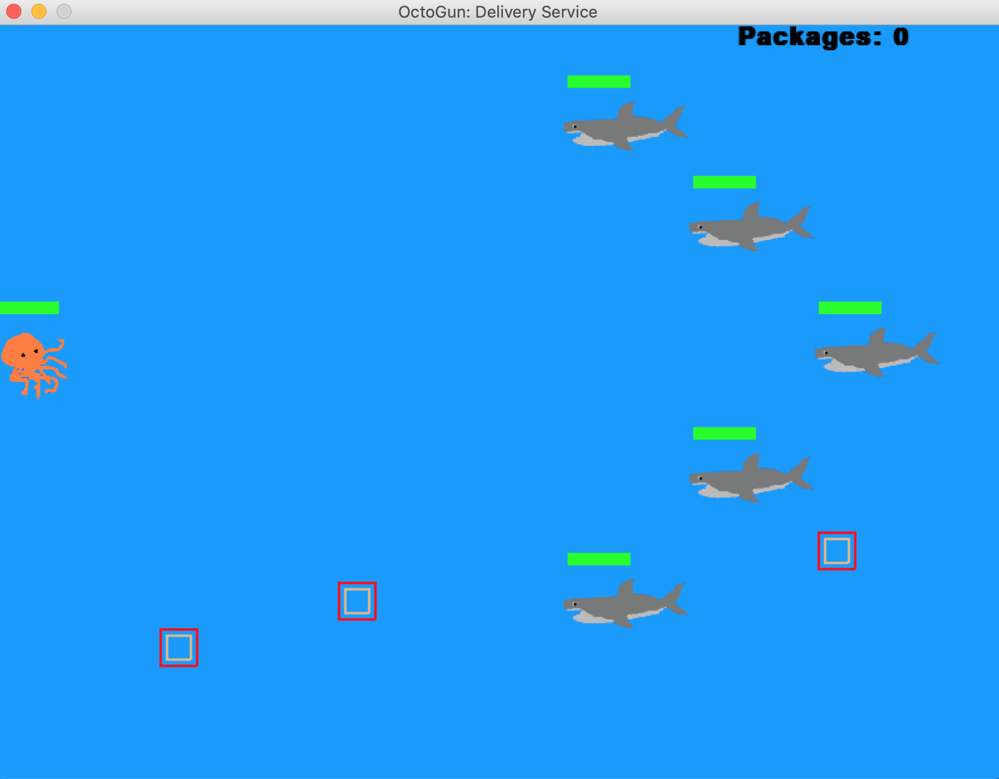
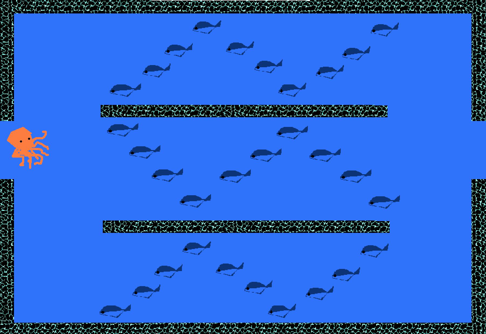

# :octopus: **OctoGun: Delivery Service** :octopus: | 
You are a gunslinger octopus whose job is to deliver packages. You must successfully navigate the seafloor, evading all sharks and eels to collect and deliver packages to your customers.

  

## To-do List:

- [] octo & squid => end game
- [] fix bug: octo still shooting when not visible 
- [] deploy as a [Stand Alone App](https://stackoverflow.com/questions/10527678/how-to-send-my-game-made-with-pygame-to-others)
- [x] render octo & octo moving()
- [x] octo has projectiles
- [x] add enemy shark: has health bar, is moving correct direction
- [x] add packages: 1. create package class, 2. render 
- [x] fix bug on shark collision
- [x] add more sharks
- [x] background music
- [x] octo health render, decrease when touching shark
- [x] octo & package collision logic
- [x] score bug
- [x] restart & game over screens
- [x] add package score when octo collides
- [x] SFX
- [x] bug on loading screen
- [x] octo & squid collision
- [x] randomize squid position & velocity
- [x] bug on `x` close button & game over screen, pinpointed to `self.playing` & `self.running` vars
- [x] render G.O. screen on player kill

## Proof of Concept:
- :white_check_mark: Render octopus with game controls
- :white_check_mark: Detect collisions and have feedback in the game
- :white_check_mark: Game success & game over scenario

**Tech Personal Goals:**
- Know how to manage state, controls, & collision using the PyGame physics engine
- Use scenes if possible
- Use open-source sprites if possible or create one. Use static images for now.

**Creativity Goals**
- Make sure to tie in Octopus-related themes:
  - 8 lives
  - 8 packages to return
- Produce some images, possibly a sprite sheet

## Game Controls (thus far)
- **ESC** quit game
- **SPACEBAR** shoot ink bullets
- **UP** move octopus up
- **DOWN** move octopus down
- **LEFT** move octopus left
- **RIGHT** move octopus right

## Concept Art

